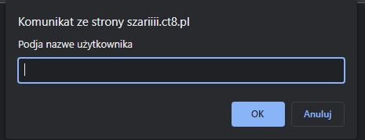
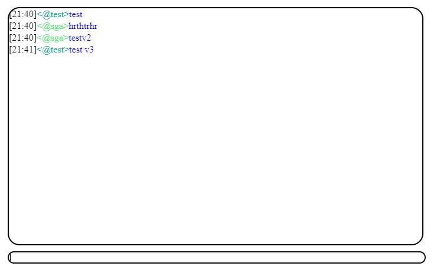
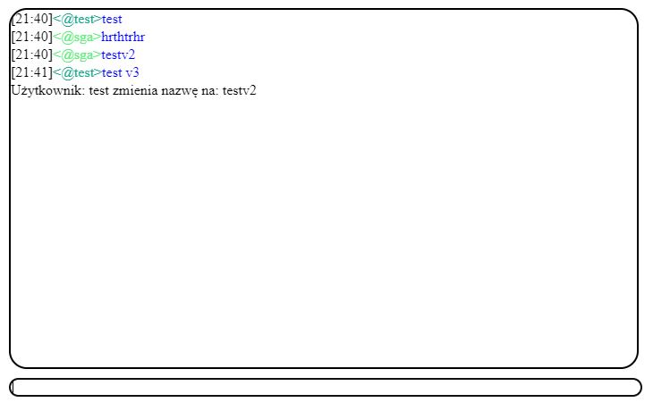

<h1>Chat</h1>

You can test yourself on: <a href="http://szariiii.ct8.pl/irc/index.html">http://szariiii.ct8.pl/irc/index.html</a>

Chat created with using php and js. When you join to chat you must input your nick and then you can write and see messages which was created while you joined (older messages will not be showen). You can alsow use some comands.

<h2>Comands:</h2>
<ul>
    <li>/quit - disconnect from the chat</li>
    <li>/color (color) - change color of chat eg. /color #FF0000</li>
    <li>/nick (nick) - change nick eg. /nick test </li>
</ul>

<h2>Screen shots:</h2>

